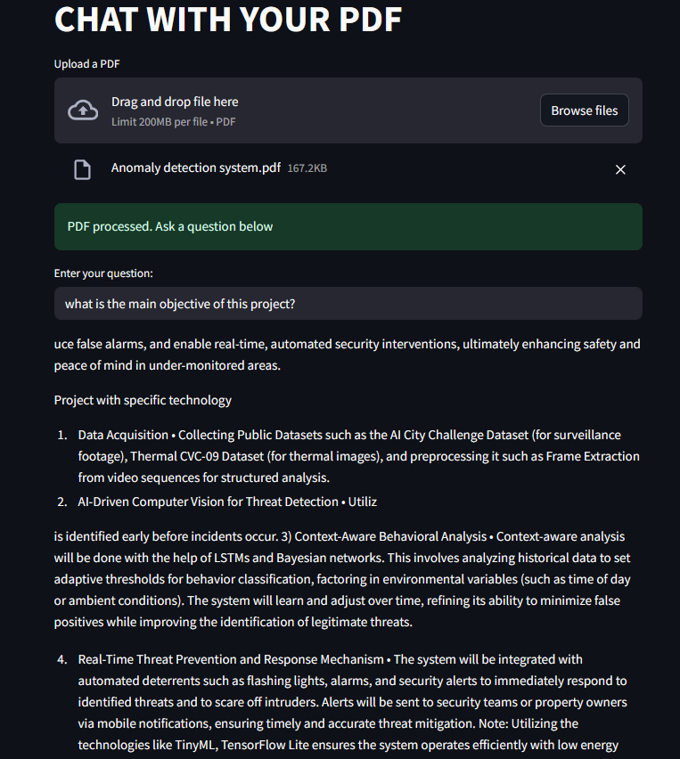

# PDF Chatbot – Talk to Any PDF

An AI-powered chatbot that lets you upload a PDF and interact with it using natural language. It extracts the content, understands it using sentence embeddings, and responds to your queries contextually.

---

## Features

- Upload any PDF file
- Ask questions and get meaningful answers
- Uses semantic search instead of keyword matching
- Powered by sentence-transformer embeddings
- Lightweight and runs locally with Streamlit

---

## Technologies Used

- **Python**
- **PyMuPDF** (`fitz`) – for extracting text from PDFs
- **Sentence Transformers** – for generating embeddings
- **Faiss** – for fast similarity search
- **Streamlit** – for building the interactive frontend

---

## How It Works

1. **Upload PDF**: The user uploads a document via the Streamlit interface.
2. **Text Extraction**: Text is extracted page-wise using PyMuPDF.
3. **Chunking**: The extracted text is split into manageable chunks.
4. **Embedding**: Each chunk is embedded into a high-dimensional vector using a pre-trained transformer.
5. **Search**: When a user asks a question, it's embedded and matched to the closest chunks.
6. **Answer**: The top-matching chunks are returned as the answer.

---

## Example Use Cases

- Chat with research papers
- Understand contracts or legal PDFs
- Summarize study materials
- Query long reports and manuals

---

## Tips for Best Results

- Upload clean PDFs with selectable (not scanned image) text.
- Ask specific and clear questions (e.g., “What is the conclusion of the study?”).
- Ideal for documents under ~100 pages for performance.

---

